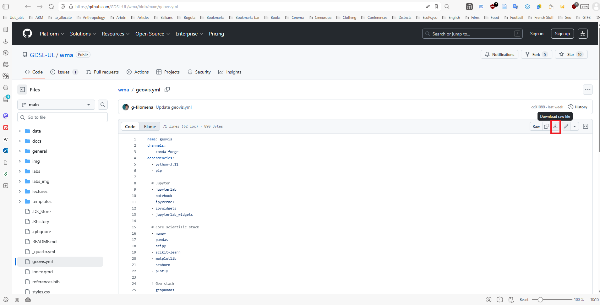
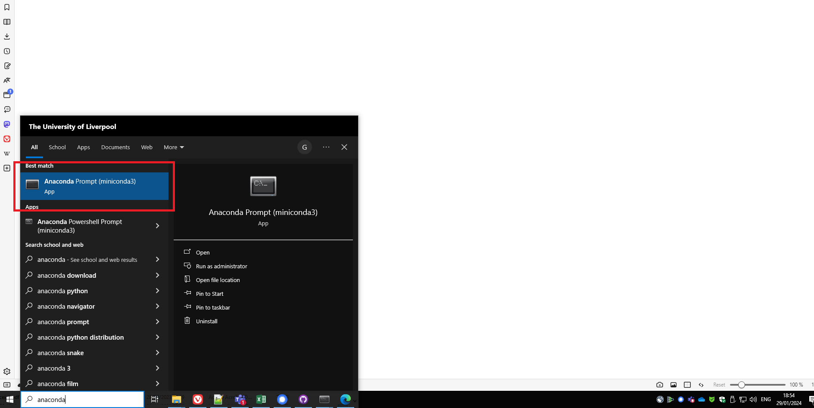
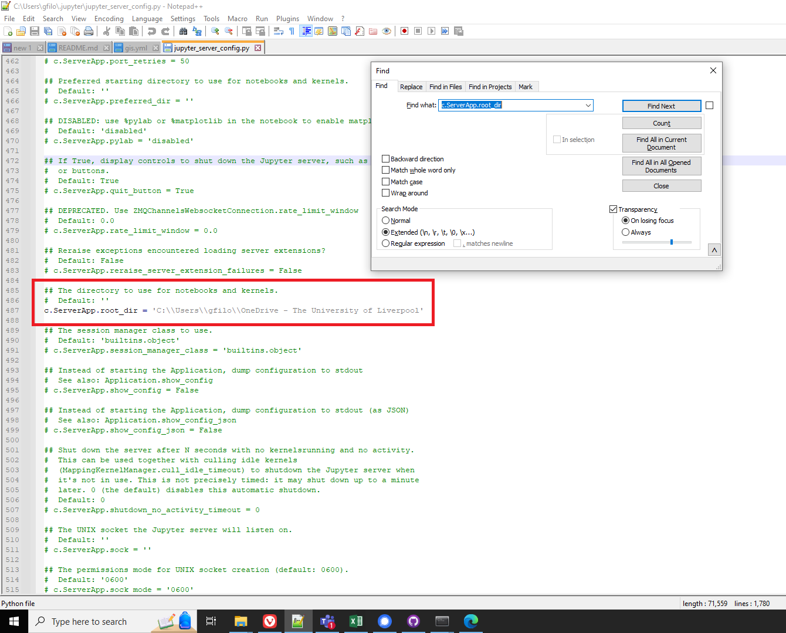
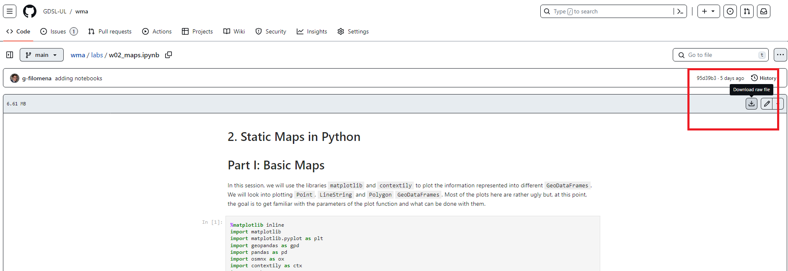
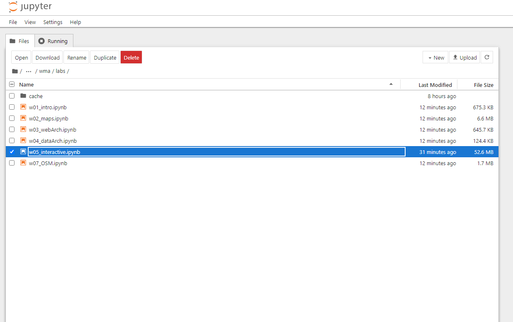
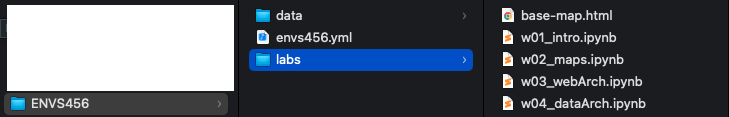
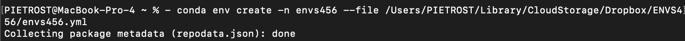
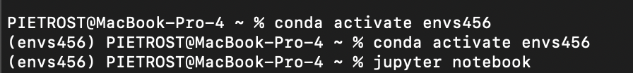

# Setting up the Working Environment {.unnumbered}

Follow the instructions for your Operating System and test your installation. If you experience any issues, write a message on the MS Teams channel of the module.

Setting up the Python environment is necessary for:

- Executing the [Jupyter Notebooks](https://docs.jupyter.org/en/latest/) of the Lab sessions of the course.
- Preparing your own Jupyter Notebooks for the assignments (one each).

We will use `Miniconda` to handle our working environment.

*Miniconda is a free minimal installer for conda. It is a small bootstrap version of Anaconda that includes only conda, Python, the packages they both depend on, and a small number of other useful packages.*

---

## Set up Miniconda (and Python) on MS Windows {.unnumbered}

### Installation {.unnumbered}

1. Install Miniconda:
   - *Option 1*: On a UoL Machine: Download and install Miniconda from [here](https://repo.anaconda.com/miniconda/Miniconda3-latest-Windows-x86_64.exe). This will install Miniconda and Python in `C:\`. If this process is aborted because it requires administrator rights, press `Start`, select `Install University Applications`, type and choose `Miniconda`.
   - *Option 2*, **Recommended**: Install Miniconda on your personal laptop: Follow the instructions [here](https://docs.conda.io/projects/miniconda/en/latest/miniconda-install.html).

2. During the installation, leave the default settings. In particular, when asked whom to "Install Miniconda for", choose "Just for me".

**Important:** If you do choose to work on University Machines you will have to reinstall `Miniconda` every lab session unless you use a PC where Miniconda has been installed already.

---

### Set up the Directories {.unnumbered}

1. Create a folder where you want to keep your work conducted throughout this course. For example, call it `geovis`. You can save it wherever you want. If you are working on a university machine, it could be worth creating it in `M:\`, which should be your "virtual" hard-disk.

   **Example fictional path (Windows, personal laptop):** `C:\Users\YourName\Documents\geovis\`  
   **Example path (Windows, UoL machine):** `M:\geovis\`

2. Download the [data](https://downgit.github.io/#/home?url=https://github.com/GDSL-UL/wma/tree/main/data) and the [images](https://downgit.github.io/#/home?url=https://github.com/GDSL-UL/wma/tree/main/labs_img) for running and rendering the Jupyter notebooks.

3. Unzip the folders and move the nested folders into the folder `geovis`.

4. Create another folder called `labs`.

The folder structure should look like:

```text
geovis/
├── data/
├── labs_img/
└── labs/
```

---

### Set up the Python Environment {.unnumbered}

1. Download the `geovis.yml` from GitHub by clicking `Download raw file`, top right, [at this page](https://github.com/GDSL-UL/wma/blob/main/geovis.yml).



2. Save it in the folder `geovis` created before.

   **Example path:** `C:\Users\YourName\Documents\geovis\geovis.yml`; **UoL machine example:** `M:\geovis\geovis.yml`

3. Type in the search bar and find the `Anaconda Prompt (miniconda 3)`. Launch it. The terminal should appear.



4. In the **Anaconda Prompt**, run: `conda env create -n geovis --file "C:\Users\YourName\Documents\geovis\geovis.yml"`

5. Then run: `conda env update -n geovis --file "C:\Users\YourName\Documents\geovis\geovis.yml" --prune`
   
6. If you are prompted any questions, press `y`. This process will install all the packages necessary to carry out the lab sessions.

7. In the **Anaconda Prompt** write and run: `conda activate geovis`. This activates your working environment.

8. *Necessary on University machines, otherwise optional:* configuration of Jupyter Notebooks

- In the **Anaconda Prompt**, run: `jupyter server --generate-config`. This should create a file at:  `C:\Users\YourName\.jupyter\jupyter_server_config.py`

- Open the file with a text editor (e.g. [Notepad++](https://notepad-plus-plus.org)). Do a `Ctrl+F` search for:
  `c.ServerApp.root_dir`

- Uncomment it and set it to your course folder (the folder where you created `geovis`). Example: `c.ServerApp.root_dir = r"M:\geovis"`(use your own path if different).

- Save the file and close it.



---

### Start a Lab Session {.unnumbered}

1. Download the Jupyter Notebook of the session in your folder. Choose one Jupyter notebook and click `Download raw file` as shown below.



2. Save the file in the `labs` folder within your `geovis` folder on your machine.

3. Type in the search bar, find and open the `Anaconda Prompt (miniconda 3)`.

4. In the **Anaconda Prompt** run: `conda activate geovis`

5. (*Recommended*) "Move" into your course folder so Jupyter opens in the right place: `cd "C:\Users\YourName\Documents\geovis\labs"`(or `cd "M:\geovis\labs"` on UoL machines).

6. In the **Anaconda Prompt** run: `jupyter notebook`. This should open Jupyter Notebook in your default browser.



7. Navigate to your course folder and double click on the notebook downloaded in step 1.

8. You can now work on your copy of the notebook.

---

Follow these instructions and test your installation **prior to the first Lab Session**. If you experience any issues, write a message on the MS Teams channel of the module.

---

## Set up Miniconda (and Python) on Mac {.unnumbered}

### Installation {.unnumbered}

To install Miniconda on your personal laptop, follow the instructions [here](https://docs.conda.io/projects/miniconda/en/latest/miniconda-install.html). During the installation, leave the default settings. In particular, when asked whom to "Install Miniconda for", choose "Just for me".

---

### Set up the Directories {.unnumbered}

1. Create a folder where you want to keep your work conducted throughout this course. For example, call it `geovis`. You can save it wherever you want.

**Example fictional path (Mac):** `/Users/yourname/Documents/geovis/`; 

**Example fictional path (Mac):** `/Users/yourname/Library/CloudStorage/Dropbox/geovis/`

2. Download the [data](https://minhaskamal.github.io/DownGit/#/home?url=https://github.com/GDSL-UL/wma/tree/main/data) and the [images](https://minhaskamal.github.io/DownGit/#/home?url=https://github.com/GDSL-UL/wma/tree/main/labs_img) for running and rendering the Jupyter notebooks.

3. Unzip the folders and move the nested folders into the folder `geovis`.

4. Create another folder called `labs`.

The folder structure should look like:

```text
geovis/
├── data/
├── labs_img/
└── labs/
```



---

### Set up the Python Environment {.unnumbered}

1. Download the `geovis.yml` from GitHub by clicking `Download raw file`, top right, [at this page](https://github.com/GDSL-UL/wma/blob/main/geovis.yml).


2. Save it in the folder `geovis` created before.

3. Open the **Terminal**.


4. In the **Anaconda Prompt**, run:  `conda env create -n geovis --file "/Users/yourname/Documents/geovis/geovis.yml"`

5. Then run: `conda env update -n geovis --file "/Users/yourname/Documents/geovis/geovis.yml" --prune`

6. If you are prompted any questions, press `y`. This process will install all the packages necessary to carry out the lab sessions.

7. Activate the environment: `conda activate geovis`



---

### Start a Lab Session {.unnumbered}

1. Download the Jupyter Notebook of the session in your folder. Choose one Jupyter notebook from [here](https://github.com/GDSL-UL/wma/tree/main/labs) and click `Download raw file` as shown below.


2. Save the file in the `labs` folder within your `geovis` folder on your machine.

3. Open the **Terminal**.

4. Activate the environment: `conda activate geovis`

5. (*Recommended*) "Move" into your `labs` folder so Jupyter opens in the right place:
`cd "/Users/yourname/Documents/geovis/labs"`

6. Start Jupyter Notebook: `jupyter notebook`



7. This should open Jupyter Notebook in your default browser. You should see something like this:


8. Navigate to your folder. You can now work on your copy of the notebook.