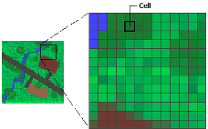
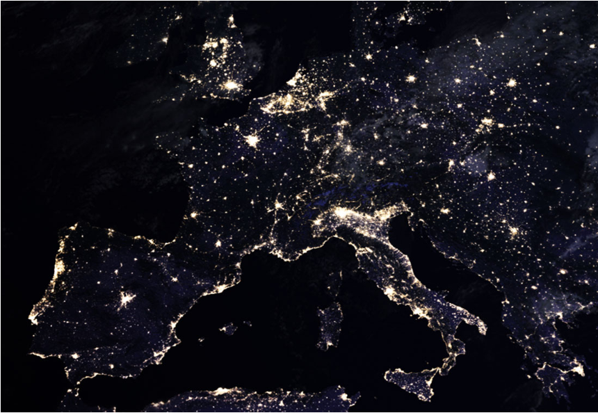
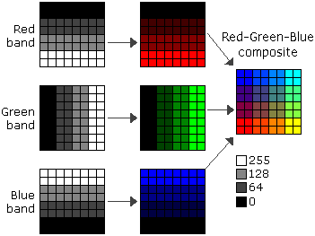

# What is a Raster?

- A **grid of pixels** — each cell holds a value
- Divides 2D space into **regular, equal-sized cells**
- Pixel values can represent:
  - **Continuous** variables — elevation, temperature, light intensity
  - **Categorical** variables — land cover class, soil type
- Value assigned by mean, centre point, or aggregation rule

## File Formats

  

 &nbsp;&nbsp;
 &nbsp;&nbsp;
 &nbsp;&nbsp;

# Types of Raster Data

## Grayscale Rasters
### *One band, continuous values*

- The simplest raster: a **single band** where pixel brightness encodes magnitude
- Examples: nightlights intensity, radar backscatter, thermal emission

## Nightlights Data
### *Human activity, visible from space*

- Darker areas → lower artificial light; brighter areas → higher intensity
- Pixel values represent **radiance or luminance** of nighttime lights
- Applications:
  - Monitoring **urban growth and sprawl**
  - Assessing **light pollution**
  - Proxying **economic activity** in data-sparse regions

## Elevation Rasters
### *The shape of the land*

*Left: raw RGB — Centre: hypsometric tint — Right: hillshade*

[Mapbox](https://blog.mapbox.com/global-elevation-data-6689f1d0ba65)

## Digital Elevation Models (DEMs)

- Each pixel value = **elevation above sea level** at that location
- Foundation for terrain analysis, hydrological modelling, flood risk
- Derived products: slope, aspect, curvature, viewshed
- Widely used in infrastructure planning, disaster response, and ecology

# Multispectral Imagery

## Beyond Visible Light
### *What sensors can see that we can't*

- Human eyes perceive **3 bands** (red, green, blue)
- Multispectral sensors capture **4–12+ bands** across the electromagnetic spectrum
- Each additional band reveals something **invisible to the naked eye**:
  - Plant health, soil moisture, surface temperature, mineral composition
- Different surfaces have distinct **spectral signatures** — fingerprints in light

*The landscape looks very different depending on which wavelengths you're listening to.*

## Multispectral Rasters

## Landsat Band Table

::: {style="font-size: 0.45em;"}
| Band | Name | Wavelength | Resolution | What it's good for |
|------|------|-----------|------------|--------------------|
| 1 | Ultra Blue (Coastal/Aerosol) | 0.43–0.45 µm | **30 m** | Coastal water, aerosol studies |
| 2 | Blue | 0.45–0.51 µm | **30 m** | Water depth, soil/vegetation distinction |
| 3 | Green | 0.53–0.59 µm | **30 m** | Peak vegetation reflectance |
| 4 | Red | 0.64–0.67 µm | **30 m** | Chlorophyll absorption; vegetation vs bare soil |
| 5 | Near Infrared (NIR) | 0.85–0.88 µm | **30 m** | Biomass, vegetation health, water body edges |
| 6 | SWIR-1 | 1.57–1.65 µm | **30 m** | Soil moisture, snow/cloud differentiation |
| 7 | SWIR-2 | 2.11–2.29 µm | **30 m** | Geology, mineralogy, fire burn scars |
| 8 | Panchromatic | 0.50–0.68 µm | **15 m** | High-resolution greyscale — pan-sharpening |
| 9 | Cirrus | 1.36–1.38 µm | **30 m** | Detecting high-altitude cirrus cloud contamination |
| 10 | Thermal Infrared (TIRS-1) | 10.6–11.19 µm | **100 m** | Surface temperature |
| 11 | Thermal Infrared (TIRS-2) | 11.50–12.51 µm | **100 m** | Surface temperature (more accurate dual-band retrieval) |
:::

## True Colour: Bands 2, 3 and 4
### *Blue, green, red — what the eye would see*

# Resolution: The Fundamental Trade-off

## Spatial Resolution
### *Can you see what you're looking for?*

- Defines the **smallest distinguishable feature** in an image
- A 1m pixel ≠ a 10m pixel — the difference is *a building vs. a blur*
- **Higher resolution → richer insight** into land use, urban change, disaster damage
- But there's a cost: **larger files, more compute, harder to scale**

## Temporal Resolution
### *When did that change — and how fast?*

- How **frequently** a sensor revisits the same location
- High temporal resolution lets us watch the world **unfold in near real-time**:
  - Flood progression 
  - Crop growth cycles
  - Urban expansion ️
- The faster things change, the more temporal resolution matters

## Data Volume & Storage
### *The deluge is already here*

- Modern satellites generate **terabytes per day** — and it's accelerating
- Storage isn't just a technical problem, it's a **scientific bottleneck**
- Traditional on-premise hardware: expensive, slow to scale
- Cloud-based storage: flexible, but raises questions of **cost, access, and sovereignty**

## Where to Get Imagery

::: {style="font-size: 0.8em;"}
- **High spatial resolution** — costly commercial products
- **Lower spatial resolution** — free via NASA, ESA, and others:
  - [USGS Earth Explorer](http://earthexplorer.usgs.gov/) — Landsat, MODIS, and more
  - [NASA Earthdata Search](https://search.earthdata.nasa.gov/search) — full NASA Earth observation catalogue
  - [Copernicus Open Access Hub](https://scihub.copernicus.eu/) — ESA Sentinel imagery (1, 2, 3, 5P)
  - [AppEEARS (LP DAAC)](https://lpdaacsvc.cr.usgs.gov/appeears/) — easy subsetting of NASA land products
  - [Landsat on AWS](https://aws.amazon.com/public-data-sets/landsat/) — cloud-hosted Landsat archive
:::

# Supervised Classification

## Turning Pixels into Meaning
### *What are we actually doing?*

- Every pixel in a multispectral image has a **spectral signature** — a fingerprint of how it reflects light across bands
- Supervised classification asks: **can we teach an algorithm to recognise these fingerprints?**
- Goal: assign every pixel a land cover label — urban, rural, water, vegetation...

## Why Multispectral for Classification?
### *More bands = more separability*

- Standard RGB: **3 bands** — multispectral sensors: **4–12+**
- Key bands for urban/rural distinction:
  - **NIR** → healthy vegetation glows; concrete doesn't
  - **Red Edge** → separates crops from forests
  - **SWIR** → distinguishes built surfaces and bare soil
- More spectral dimensions = classes that overlap in RGB **pull apart**

## Training Points
### *The human input the algorithm depends on*

- You must provide **labelled examples** of each class — this is the "supervised" part
- Training points tell the classifier: *"this is what urban looks like spectrally"*
- Quality requirements:
  - **Representative** — capture the variety within each class
  - **Balanced** — avoid over-representing one class
  - **Accurate** — wrong labels poison the model
- Collected via: field survey, manual digitising, or existing land cover datasets

## The Classification Pipeline
### *From labelled points to labelled map*

1. **Define classes** — urban, peri-urban, agriculture, forest, water...
2. **Collect training points** — ideally 50–200+ samples per class
3. **Extract spectral values** at training locations
4. **Train a classifier** — Random Forest, SVM, Maximum Likelihood...
5. **Apply to full image** — every pixel gets a label
6. **Validate** — withhold test points, compute accuracy metrics

*The pipeline is straightforward. The judgement calls within it are not.*

## Accuracy Assessment
### *How do we know if it worked?*

- Withhold a **test set** (20–30% of labelled points) — never used in training
- Build a **confusion matrix**: where does the classifier get confused?
  - Urban misclassified as bare soil?
  - Dense vegetation confused with rural settlements?
- Key metrics: **Overall Accuracy**, **Kappa coefficient**, **Per-class F1**
- Urban/rural boundaries are notoriously **fuzzy** — peri-urban is hard

*A 90% accurate map still means 1 in 10 pixels is wrong — at scale, that matters.*

# ☁️ The Cloud Problem

- Clouds are **opaque to optical sensors** — where there's cloud, there's no data
- In tropical regions, cloud cover can exceed **80% of observations** year-round
- A single cloudy acquisition can ruin a time-sensitive classification
- Cloud **shadows** are almost as problematic — spectrally dark, easily confused with water or urban areas

# Questions

#

 [Geographic Data Science]{xmlns:dct="http://purl.org/dc/terms/" property="dct:title"} by <a xmlns:cc="http://creativecommons.org/ns#" href="http://pietrostefani.com" property="cc:attributionName" rel="cc:attributionURL">Elisabetta Pietrostefani</a> is licensed under a <a rel="license" href="http://creativecommons.org/licenses/by-sa/4.0/">Creative Commons Attribution-ShareAlike 4.0 International License</a>.