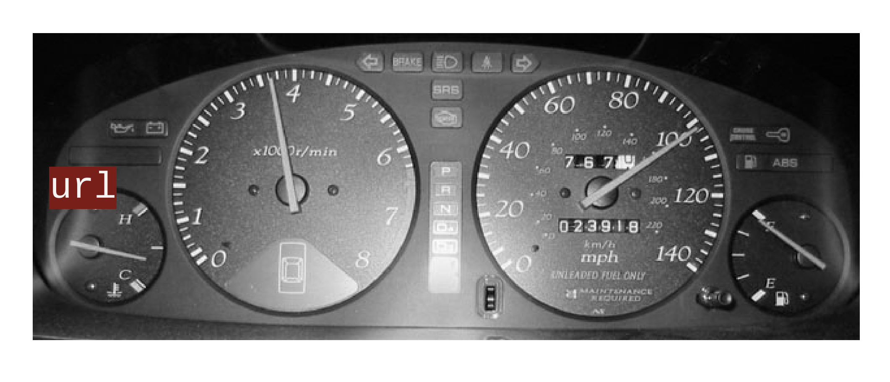
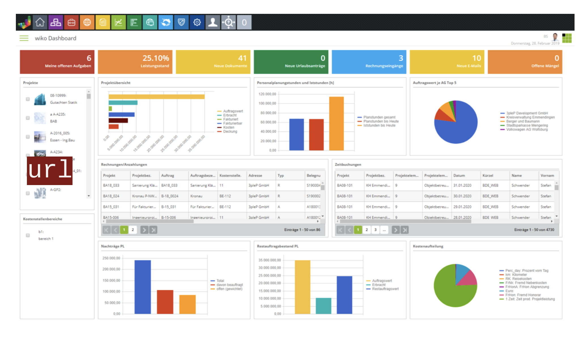
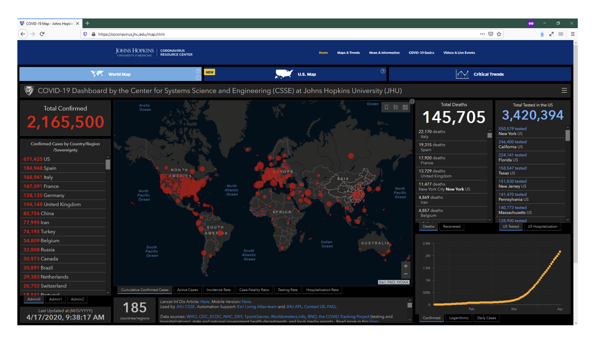
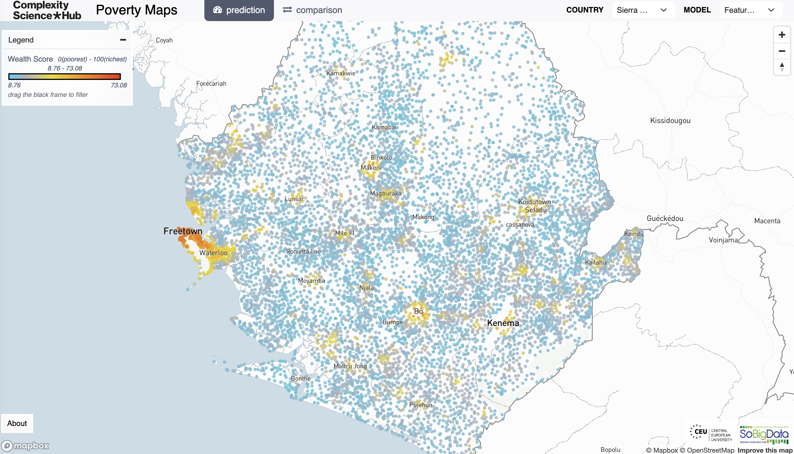
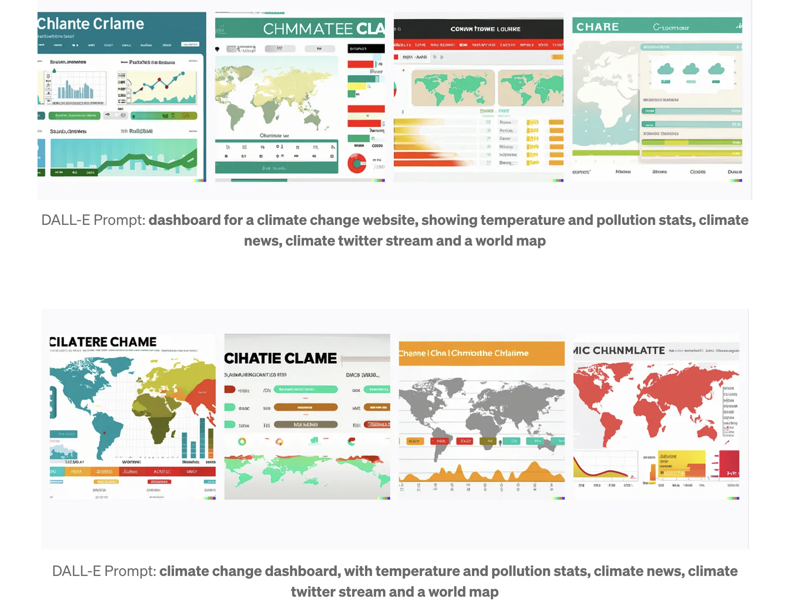

# Today

- What?
- Why?
- How?

# Dashboards: *What?* 

# 

#

#

#

#

# (Digital) Dashboards

*[…] single-screen display of the most important information people need to do a job, presented in a way that allows them to monitor what’s going on in an instant*

Few (2006)

# (Digital) Dashboards

- “Centralisers” of data
- Not only about maps
- Up-to-date (dynamic/real time)

# Dashboards: *why (not)?*

# Why?

- More data, more problems: need to access streams effectively
- Dynamic data requires dynamic mediums
- Decision-driven views: focus on “key indicators"

# Useful features

- “Useful model” distilling the essential in one place
- Powerful, yet accessible (client/server model)
- Enable “designed” analysis

# Why not?

Critical considerations

- Mechanistic view of complex/human systems
- Reductionist: Focus only on what can (and is) be measured
- Bias: What is measured? What is left out?

# Map-based dashboards

- At least one view is a map, but may combine with other views
- Organise information presented through space/geography
- Limited but focused analysis through interactivity (“GIS on a browser”)

# 

# Dashboards: *how?*

# How to design a dashboard

- Purpose first, technology next
- One-rule **does not** fit-all
- Learning by (others’) mistakes

# Thirteen mistakes in Dashboard Design (Few, 2006)

# Thirteen mistakes… (1-3)
1. Exceeding a single screen
2. Supplying inadequate context for the data
3. Excessive detail/precision

# Thirteen mistakes… (4-6)
4. Choosing a deficient measure
5. Inappropriate display media
6. Meaningless variety

# Thirteen mistakes… (7-9)
7. Poorly designed display media
8. Inaccurate encoding of quantitative data
9. Poor arrangement

# Thirteen mistakes… (10-13)
10. Highlighting important data ineffectively
11. Display cluttering/decoration
12. Color mis/overuse
13. Unattractive visual displays

# Enabling analysis
- Not only display of information
- Interactivity fits more into one screen
- “Purpose-built GIS”
